# 2. High Level Architecture

## 2.1 Technical Summary

This project implements a **containerized 3-tier microservices architecture** deployed to Kubernetes, following cloud-native patterns optimized for a DevOps learning journey. The frontend (React/Next.js) serves as a minimal UI layer, the backend (Python FastAPI) handles business logic with MLOps-ready instrumentation, and PostgreSQL provides persistent storage.

The architecture prioritizes **local-first development** with Kind clusters, while maintaining full compatibility with Azure cloud services (ACR, Key Vault, optional AKS). Infrastructure is managed declaratively through Terraform with remote state, applications are packaged as Helm charts orchestrated by Helmfile, and the entire pipeline is automated via GitHub Actions. This design achieves all 9 PRD goals while building a foundation for future MLOps extension.

## 2.2 Platform and Infrastructure Choice

**Selected Platform:** Azure (Hybrid Local/Cloud)

| Platform | Pros | Cons | Fit for Project |
|----------|------|------|-----------------|
| **Azure (Hybrid Local/Cloud)** | Free tier + $200 credits, ACR/Key Vault included, AKS for validation | Learning curve for Azure-specific services | ✅ **RECOMMENDED** |
| **AWS** | Mature ecosystem, EKS well-documented | No free credits context | ❌ Not aligned |
| **Local Only (Kind)** | Zero cost, full control | Misses cloud provider experience | ❌ Incomplete learning |

**Key Services:**
- **Local:** Kind (Kubernetes), Docker Desktop
- **Azure:** ACR (Container Registry), Key Vault (Secrets), Storage Account (Terraform state), AKS (bonus)
- **CI/CD:** GitHub Actions

**Deployment Regions:**
- Local: Kind cluster on development machine
- Azure: West Europe (or nearest region with free tier availability)

## 2.3 Repository Structure

**Structure:** Monorepo (single repository)

**Rationale:**
- Simplifies CI/CD pipeline configuration (single trigger point)
- Easier atomic commits across app + infrastructure changes
- Appropriate for learning project (all context in one place)
- Standard pattern for small-to-medium projects

**Monorepo Tool:** npm workspaces (lightweight) or none (simple folder structure)

## 2.4 High Level Architecture Diagram

```mermaid
graph TB
    subgraph "User Access"
        U[👤 User/Browser]
    end

    subgraph "CI/CD Layer"
        GHA[GitHub Actions]
        ACR[Azure Container Registry]
    end

    subgraph "Kubernetes Cluster - Kind/AKS"
        subgraph "Ingress Layer"
            ING[NGINX Ingress Controller]
            CM[cert-manager]
        end

        subgraph "Application Namespace"
            FE[Frontend<br/>Next.js]
            API[API<br/>FastAPI]
            DB[(PostgreSQL)]
        end

        subgraph "Monitoring Namespace"
            PROM[Prometheus]
            GRAF[Grafana]
            LOKI[Loki]
            PROM_TAIL[Promtail]
        end

        subgraph "Secrets"
            K8S_SEC[K8s Secrets]
            KV_CSI[Key Vault CSI]
        end
    end

    subgraph "Azure Cloud"
        AKV[Azure Key Vault]
        TF_STATE[Storage Account<br/>Terraform State]
    end

    U -->|HTTPS| ING
    ING -->|/| FE
    ING -->|/api| API
    FE -->|REST| API
    API --> DB
    API --> K8S_SEC
    K8S_SEC -.->|Phase 2| KV_CSI
    KV_CSI -.-> AKV

    GHA -->|Push Images| ACR
    GHA -->|Deploy| ING
    GHA -->|Terraform| TF_STATE

    PROM -->|Scrape| API
    PROM -->|Scrape| FE
    PROM_TAIL -->|Collect Logs| API
    PROM_TAIL -->|Collect Logs| FE
    PROM_TAIL --> LOKI
    GRAF --> PROM
    GRAF --> LOKI

    CM -->|TLS Certs| ING
```

## 2.5 Architectural Patterns

| Pattern | Description | Rationale |
|---------|-------------|-----------|
| **Containerized Microservices** | Each component runs in isolated containers | Standard cloud-native pattern, enables independent scaling |
| **3-Tier Architecture** | Presentation → Business Logic → Data | Clear separation of concerns, industry standard |
| **Infrastructure as Code** | All infra defined in Terraform | Reproducibility, version control, GitOps foundation |
| **Declarative Deployment** | Helm charts with Helmfile orchestration | Environment-specific config, rollback capability |
| **GitOps-Adjacent CI/CD** | GitHub Actions triggers deployments | Pipeline as code, full automation |
| **Observability-First** | Metrics (Prometheus) + Logs (Loki) from day 1 | Critical for MLOps, enables proactive monitoring |
| **Progressive Secrets Management** | K8s Secrets → Azure Key Vault migration | Learn fundamentals first, then enterprise patterns |
| **API Gateway Pattern** | NGINX Ingress as single entry point | Centralized TLS termination, routing |
| **Health Check Pattern** | Liveness + Readiness probes on API | K8s best practice, enables self-healing |

---
