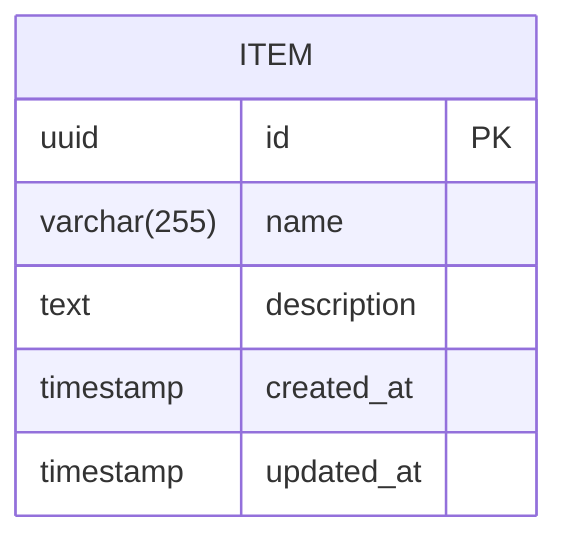

# 4. Data Models

The data model is intentionally **minimal** as the application serves as a vehicle for DevOps learning.

## 4.1 Item

**Purpose:** Core business entity demonstrating full CRUD operations through the API, database persistence, and frontend display.

| Attribute | Type | Description |
|-----------|------|-------------|
| `id` | UUID | Unique identifier, auto-generated |
| `name` | string | Item name, required, max 255 chars |
| `description` | string | Optional item description |
| `created_at` | timestamp | Auto-set on creation |
| `updated_at` | timestamp | Auto-updated on modification |

### TypeScript Interface

```typescript
// packages/shared/types/item.ts

export interface Item {
  id: string;
  name: string;
  description?: string;
  createdAt: Date;
  updatedAt: Date;
}

export interface CreateItemRequest {
  name: string;
  description?: string;
}

export interface UpdateItemRequest {
  name?: string;
  description?: string;
}

export interface ItemListResponse {
  items: Item[];
  total: number;
}
```

### Python Model

```python
# apps/api/models/item.py

from datetime import datetime
from uuid import UUID, uuid4
from pydantic import BaseModel, Field

class ItemBase(BaseModel):
    name: str = Field(..., max_length=255)
    description: str | None = None

class ItemCreate(ItemBase):
    pass

class ItemUpdate(BaseModel):
    name: str | None = Field(None, max_length=255)
    description: str | None = None

class Item(ItemBase):
    id: UUID = Field(default_factory=uuid4)
    created_at: datetime
    updated_at: datetime

    class Config:
        from_attributes = True
```

## 4.2 Health Check Models

```typescript
export interface HealthResponse {
  status: 'healthy' | 'unhealthy';
  timestamp: Date;
}

export interface ReadinessResponse {
  status: 'ready' | 'not_ready';
  checks: {
    database: 'ok' | 'error';
  };
  timestamp: Date;
}
```

## 4.3 Entity Relationship Diagram



---
