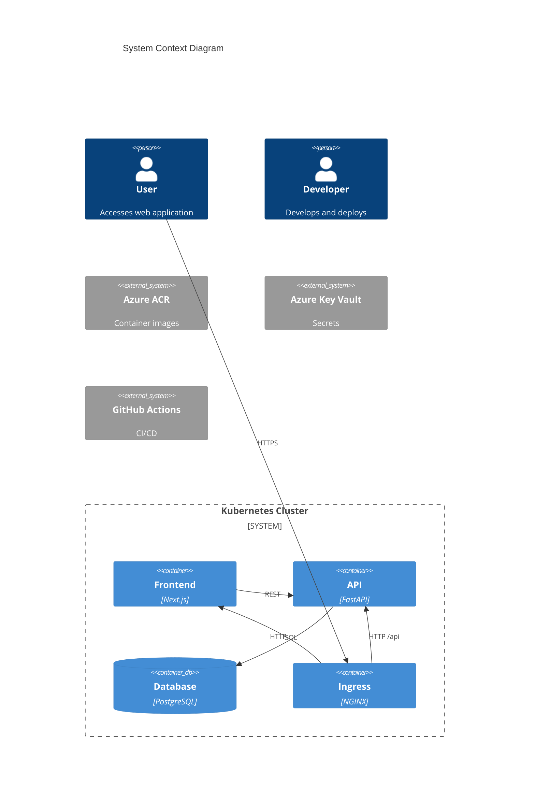

# 6. Components

## 6.1 Application Components

| Component | Responsibility | Technology | K8s Resources |
|-----------|----------------|------------|---------------|
| **Frontend** | Web UI, data display | Next.js 14 | Deployment, Service, ConfigMap |
| **API** | Business logic, REST endpoints | FastAPI | Deployment, Service, ConfigMap, Secret, ServiceMonitor |
| **PostgreSQL** | Data persistence | PostgreSQL 15 | StatefulSet, Service, PVC, Secret |

## 6.2 Infrastructure Components

| Component | Responsibility | Technology |
|-----------|----------------|------------|
| **NGINX Ingress** | Traffic routing, TLS termination | ingress-nginx Helm chart |
| **cert-manager** | TLS certificate automation | cert-manager Helm chart |
| **CSI Driver** | Azure Key Vault secret mounting | secrets-store-csi-driver |

## 6.3 Observability Components

| Component | Responsibility | Technology |
|-----------|----------------|------------|
| **Prometheus** | Metrics collection | kube-prometheus-stack |
| **Grafana** | Visualization | kube-prometheus-stack |
| **Loki** | Log aggregation | loki-stack |
| **Promtail** | Log collection | loki-stack |

## 6.4 Component Diagram

---
