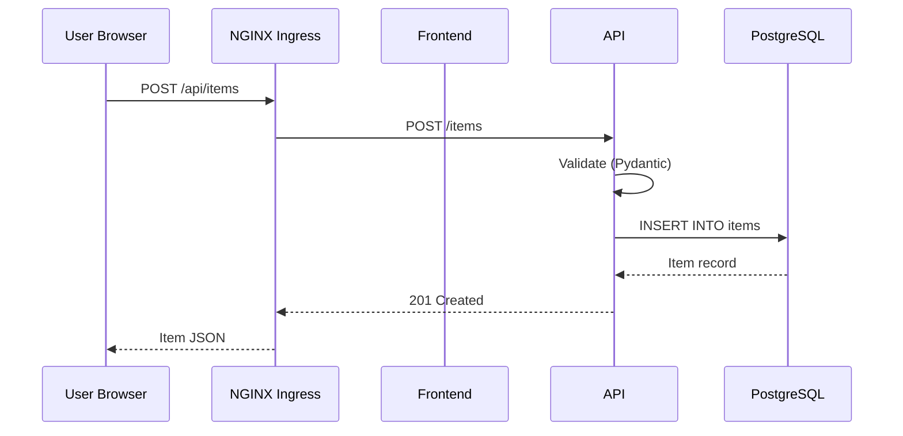
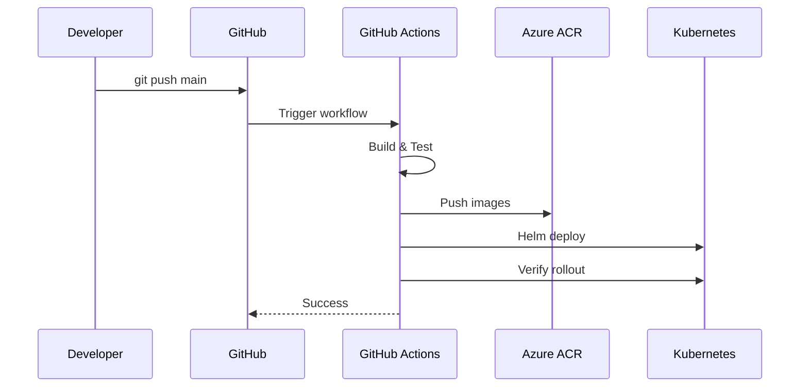
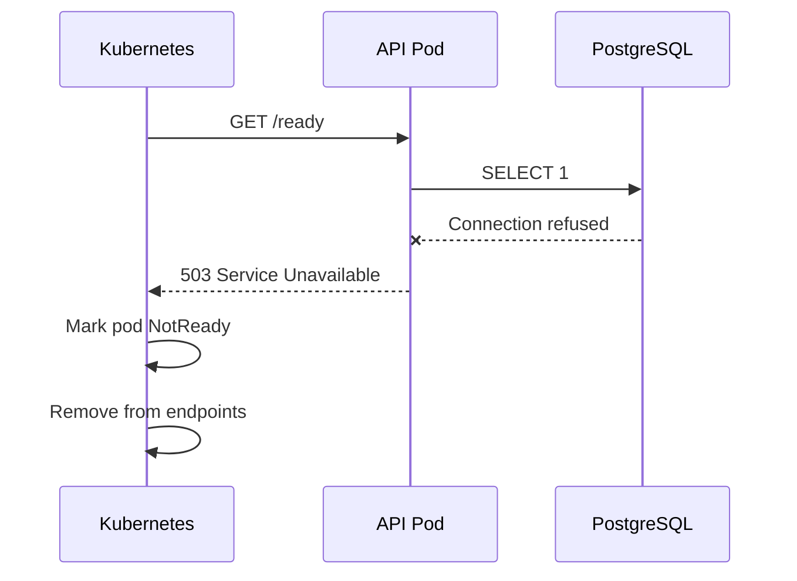
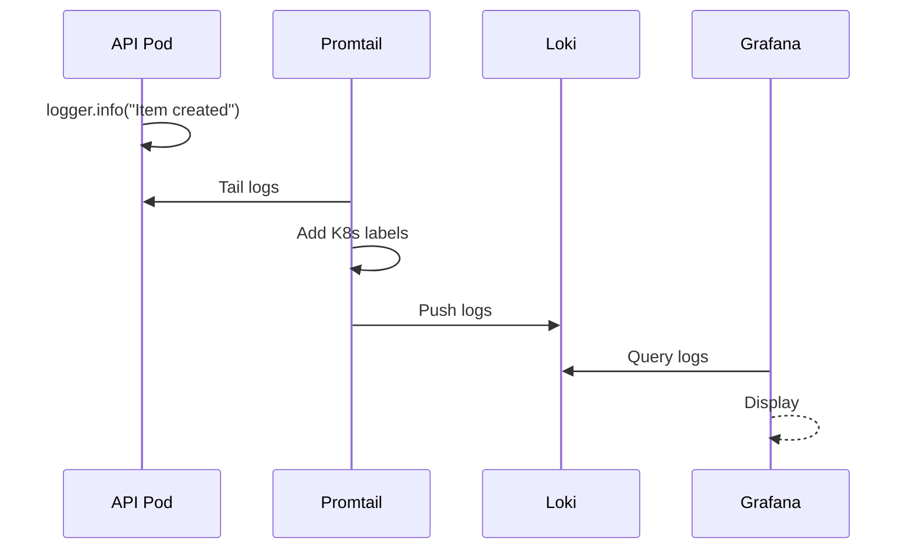

# 8. Core Workflows

## 8.1 User Creates Item

```mermaid
sequenceDiagram
    participant U as User Browser
    participant ING as NGINX Ingress
    participant FE as Frontend
    participant API as API
    participant DB as PostgreSQL

    U->>ING: POST /api/items
    ING->>API: POST /items
    API->>API: Validate (Pydantic)
    API->>DB: INSERT INTO items
    DB-->>API: Item record
    API-->>ING: 201 Created
    ING-->>U: Item JSON
```

## 8.2 CI/CD Pipeline

```mermaid
sequenceDiagram
    participant DEV as Developer
    participant GH as GitHub
    participant GHA as GitHub Actions
    participant ACR as Azure ACR
    participant K8S as Kubernetes

    DEV->>GH: git push main
    GH->>GHA: Trigger workflow
    GHA->>GHA: Build & Test
    GHA->>ACR: Push images
    GHA->>K8S: Helm deploy
    GHA->>K8S: Verify rollout
    GHA-->>GH: Success
```

## 8.3 Readiness Probe (Database Down)

```mermaid
sequenceDiagram
    participant K8S as Kubernetes
    participant API as API Pod
    participant DB as PostgreSQL

    K8S->>API: GET /ready
    API->>DB: SELECT 1
    DB--xAPI: Connection refused
    API-->>K8S: 503 Service Unavailable
    K8S->>K8S: Mark pod NotReady
    K8S->>K8S: Remove from endpoints
```

## 8.4 Log Aggregation

```mermaid
sequenceDiagram
    participant API as API Pod
    participant PT as Promtail
    participant LOKI as Loki
    participant GRAF as Grafana

    API->>API: logger.info("Item created")
    PT->>API: Tail logs
    PT->>PT: Add K8s labels
    PT->>LOKI: Push logs
    GRAF->>LOKI: Query logs
    GRAF-->>GRAF: Display
```

---
